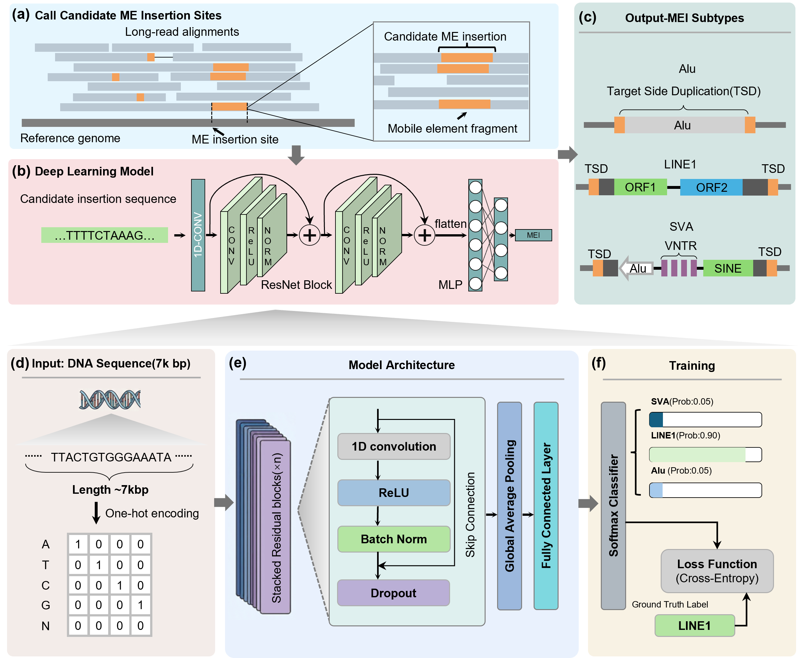

# MEIsensor (v1.0)
MEIsensor is a deep-learning based detection and calssification of mobile element insertions from long-read sequencing data.
## Overview
MEIsensor is a deep-learning based framework for the detection and classification of mobile element insertions (MEIs) from long-read sequencing data. It is designed to accurately identify and subtype Alu, LINE1, and SVA insertions.

## License

## Installation
We recommend using the conda virtual environment to install MEIsensor (Platform: Linux).
```bash
git clone https://github.com/yourname/MEIsensor.git
cd MEIsensor
```
If your CUDA version is higher than 12.8, you can directly install the environment using:
```bash
conda env create -f ANNEVO.yml -n your_env_name
```
Alternatively, you can follow the steps below to install the environment manually. This is especially recommended for users with lower CUDA versions, as you may need to manually adjust the PyTorch version and installation source.
```bash
# Create a conda environment for MEIsensor
conda create -n MEIsensor python=3.10
conda activate MEIsensor
```